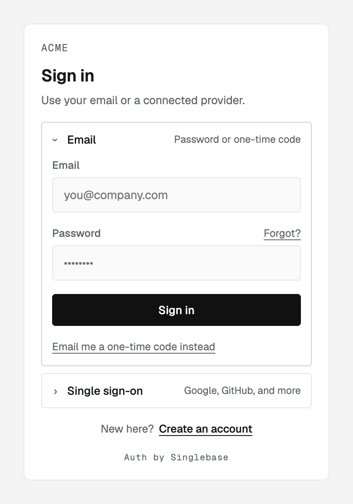
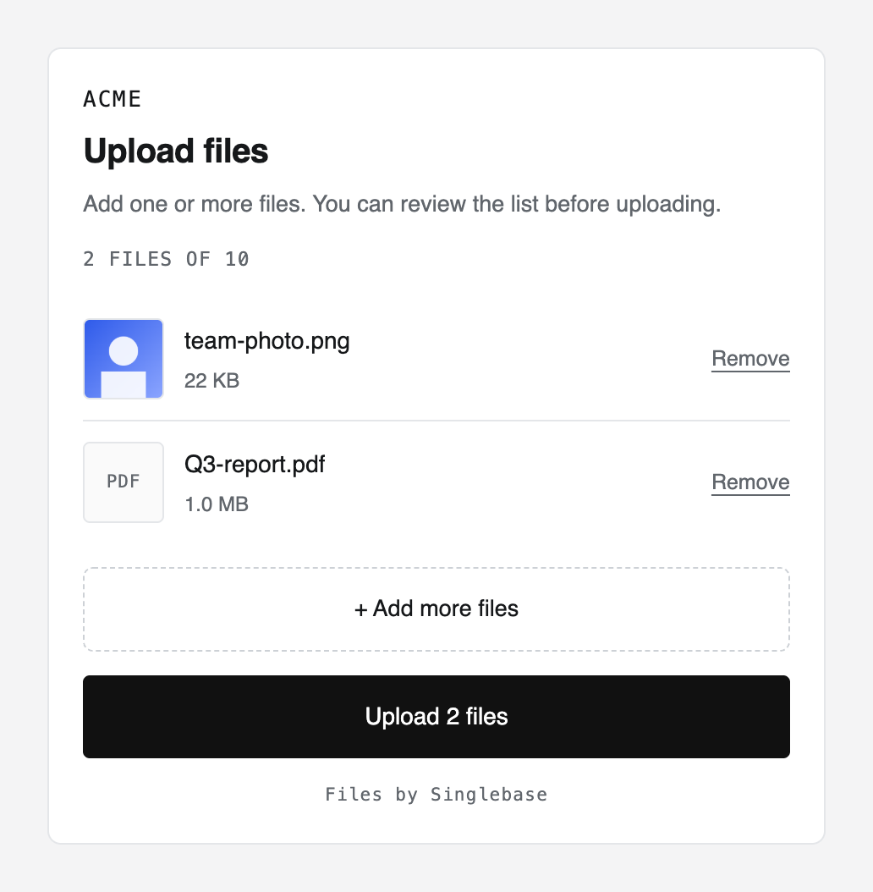
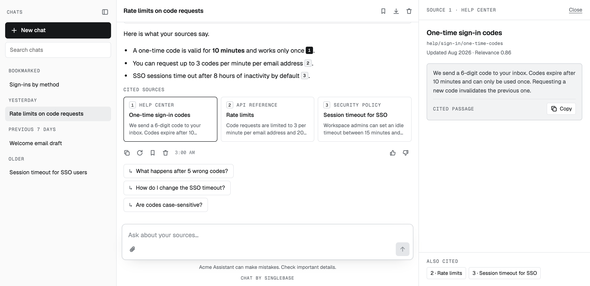

# singlebase-js

This is the offical TS/JS toolking [Singlebase](https://singlebase.io), for access Singlebase SDK and Web Components.

## Overview
**Add user authentication, file uploads and AI chat to any web app, with a single tag each.**

**singlebase-js** is the official JavaScript toolkit for
[Singlebase](https://singlebase.io). 

This documentation covers: **Singlebase SDK** & **Web Components**.

- **SDK**: one client for every Singlebase service (auth, data, files, the
  signed-in user and LLM), for when you build your own UI or logic.

- **Web Components**: ready-made UI for authentication, uploads and AI chat.
  They talk to Singlebase on their own, so the common flows need no backend
  code.

**NB**: Web components work in plain HTML, React, Vue, Svelte, or anything that renders a tag. So you can integrate easily.


### Widget / Web Components demo

| `<singlebase-authui>` | `<singlebase-uploader>` |
| --- | --- |
|  |  |

| `<singlebase-chat>` |
| --- |
|  |

---

## Quick start

Load the bundle and place the tags:

```html
<script type="module"
  src="https://cdn.jsdelivr.net/npm/@singlebase/elements/dist/singlebase-elements.min.js"
  data-singlebase-api-key="wk_YOUR_WEB_KEY"></script>

<singlebase-authui></singlebase-authui>
<singlebase-uploader accept=".pdf" max-files="5"></singlebase-uploader>
<singlebase-chat embed="launcher"></singlebase-chat>
```

Or install from npm and import what you use:

```bash
npm install @singlebase/elements @singlebase/singlebase-sdk
```

```js
import { SinglebaseClient } from "@singlebase/singlebase-sdk";
import "@singlebase/elements/authui"; // or /uploader, /chat, or "@singlebase/elements" for all

SinglebaseClient({ apiKey: "wk_YOUR_WEB_KEY" });
```

The first client becomes the page default, and every element finds it on its
own.

### Using the SDK directly

```js
const sbc = SinglebaseClient({ apiKey: "wk_YOUR_WEB_KEY" });

await sbc.auth.signIn({ email, password });
const notes = await sbc.data.query({ collection: "notes", limit: 10 });
const answer = await sbc.llm.ask({ message: "Summarize my notes" });
```

The signed-in user's token is attached to every call, and refreshed when it
goes stale.

---

## Web Components

| Element | What it gives you |
| --- | --- |
| [`<singlebase-authui>`](./docs/singlebase-authui.md) | Sign-in, sign-up, one-time codes, password reset, OAuth, invites and the account screen, plus guards and profile display |
| [`<singlebase-uploader>`](./docs/singlebase-uploader.md) | File picking, in-browser checks, previews and direct-to-storage uploads |
| [`<singlebase-chat>`](./docs/singlebase-chat.md) | An AI chat workspace: history, cited sources, rich answers, bookmarks and export, as a page, a panel or a launcher |

- **No framework, no build step.** Standard custom elements with Shadow DOM,
  loaded from one script.
- **One session per page.** The elements share one client, so signing in once
  is enough for the uploader and the chat.
- **Styled with CSS.** The same `--sb-*` custom properties and `::part()`
  hooks theme all of them.
- **Safe by default.** Only the public `wk_` web key goes in the page, and
  tokens never appear in URLs, logs or the DOM.

## Documentation

| Guide | Covers |
| --- | --- |
| [SDK](./docs/sdk.md) | `SinglebaseClient()`: connecting, calling services, auth, data, files and LLM |
| [AuthUI](./docs/singlebase-authui.md) | `<singlebase-authui>` and its guard, buttons and display elements; theming, events and methods |
| [Uploader](./docs/singlebase-uploader.md) | `<singlebase-uploader>`: views, limits, per-format rules, events |
| [Chat](./docs/singlebase-chat.md) | `<singlebase-chat>`: embeds, modes, rendering, extending, events |
| [Development](./docs/development.md) | Building, testing, the examples and releasing this repository |

## Packages

| Package | What it is |
| --- | --- |
| [`@singlebase/elements`](./packages/singlebase-elements) | The Web Components |
| [`@singlebase/singlebase-sdk`](./packages/singlebase-sdk) | The client, `SinglebaseClient()` |
| [`@singlebase/core`](./packages/core) | Shared transport and plumbing. Installed for you |

## Examples

```bash
pnpm install && pnpm example     # http://localhost:4517/examples/
```

`index.html` (auth), `customize.html` (a visual customizer that generates the
code), `uploader.html`, `chat.html` and `spa.html` (the client in a single-page
app). All run against mocks, with no account needed.

## License

MIT
